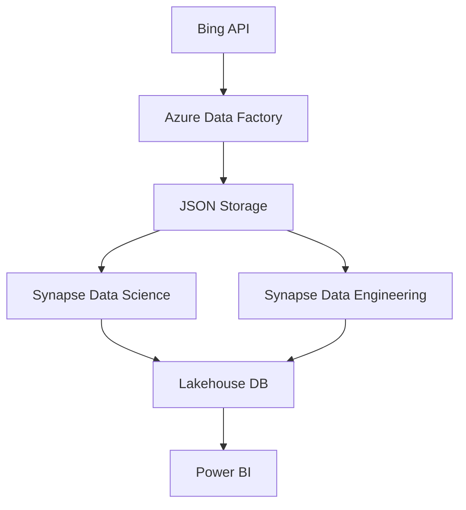

# End-to-End-Microsoft-Fabric-Azure-Data-Engineering-Pipeline

## Overview
This project demonstrates a **complete data engineering pipeline** using **Microsoft Fabric** and various **Azure services**. From fetching data via **Bing API** to processing it with **Synapse Data Engineering** and **Synapse Data Science**, and finally visualizing insights with **Power BI**, the pipeline covers all the steps in a modern data solution.

---

## Architecture

The architecture follows a modular approach:

## Data Flow
 - Data Ingestion: Fetch data via the Bing API using relevant search query parameters.
 - Data Processing & Machine Learning:
     - Synapse Data Science ML: the AnalyzedText model processes the textual data.
     - Snapse Data Engineering: transforms and enriches data.
 - Data Storage: Data is stored in JSON format and Lakehouse DB for efficient access.
 -  Visualization: Power BI connects to the data sources to create rich, interactive dashboards.

## Prerequisites
 - Azure Subscription with access to:
    - Bing API credentials.
    - Azure services like Data Factory, Synapse Data Science, Synapse Data Engineering, Lakehouse DB, and Power BI.
Bing API Key for fetching news data (https://learn.microsoft.com/en-us/bing/search-apis/bing-news-search/reference/query-parameters)
